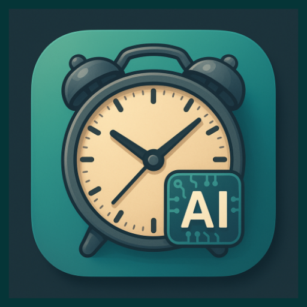
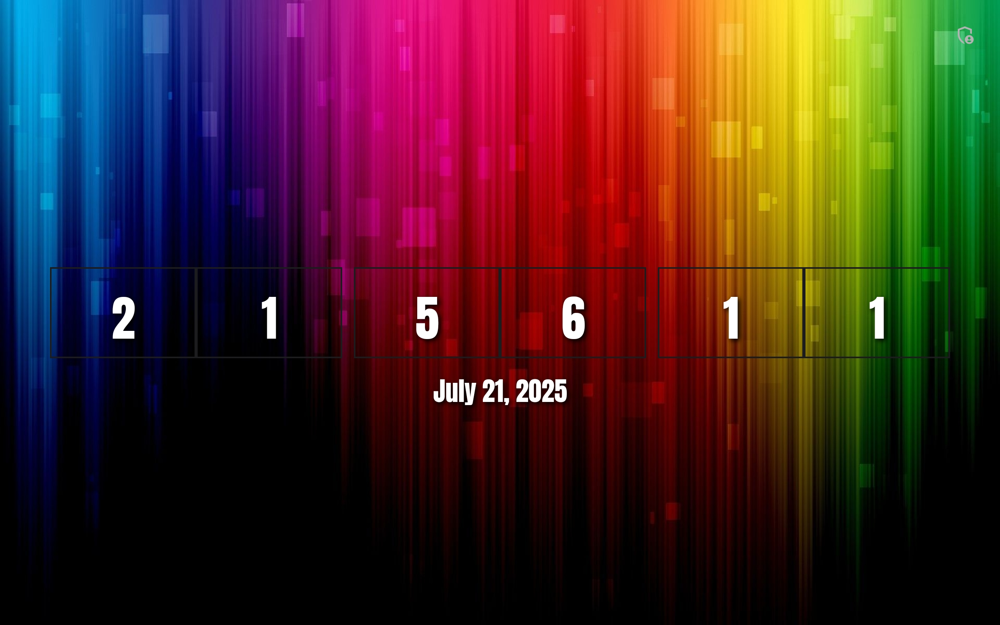

# Ora - Retro Flip Clock ⏰

Ora is a modern, full-screen clock designed for elegance, functionality, and deep personalization. Turn any device into a stunning desk clock, a nightstand companion, or a focused work timer. You have complete control to create a look that is uniquely yours. Full customization is at your fingertips, including the ability to select your own wallpaper from your device's gallery. Ora is on a path of continuous development. Future updates will bring exciting new functions and features, including planned integration with Google Gemini and Google Assistant.

<table align="center">
  <tr>
    <td align="center">
      
    </td>
    <td align="center">
      
    </td>
  </tr>
</table>

---

## ✨ Features (v1.6)

* **Complete Preset System:** Save up to 5 complete style configurations and apply them instantly from a dropdown menu. Presets now show their status (Empty/Saved) and have confirmation dialogs for overwriting and clearing.
* **Advanced Customization:**
  * **Digit Backgrounds:** Style the background of each number as Filled, Outline, or None, with full control over color and transparency.
  * **Horizontal Padding:** The clock now has elegant margins, and users can toggle extra padding around each digit.
  * **Separator Control:** The ":" separators can be hidden or have their color customized.
* **Automation & Discovery:**
  * **Randomize Style:** A "Randomize" button instantly applies a new, random combination of styles.
  * **Auto-Color Change:** An optional feature to automatically cycle through text colors at a user-defined interval.
* **Enhanced "About" Screen:**
  * A completely redesigned screen showing the app icon, version, creator, and links to the GitHub repository and version history.
  * Separate, detailed screens for a "Settings Guide" and "Battery & Power Analysis".
  * A "Buy me a coffee" screen with clickable QR codes.
* **Screenshot to Gallery:** A new button in the settings captures a high-quality screenshot of your clock design and saves it to your device's Pictures folder.
* **Major UI/UX Overhaul:** The settings menu has been completely reorganized into logical sub-menus for a much cleaner and more intuitive user experience.

---

## 📜 Version History

### Version 1.6 (Latest)
* Added a full preset system with 5 save slots.
* Completely reorganized the settings menu into logical sub-screens.
* Added advanced options for digit backgrounds (Filled, Outline, None, Color, Transparency).
* Added a "Randomize Style" button and an "Auto-change Text Colors" feature.
* Added a screenshot-to-gallery feature.
* Redesigned the "About" screen with more details and sub-pages.
* Fixed numerous bugs, including issues with custom backgrounds in presets.

### Version 1.5
* Added an auto-hide feature for the settings button with a customizable delay.
* Added toggle switches to enable or disable text shadows on all text elements.
* The app now automatically returns to full-screen mode after 15 seconds of inactivity.
* Fixed layout issues to ensure the clock fits perfectly on narrow (phone) screens.
* Corrected various bugs with timers and settings not applying correctly.

### Version 1.4
* Added the ability to select a custom background image from the device's photo gallery.
* Implemented runtime permissions for media access and secure local copying of the image.

### Version 1.3
* Added 12/24 hour time format selection and AM/PM toggle.
* Added separate size and color customization for the AM/PM text.
* Added a "Reset to Default" option.

(Older versions omitted for brevity)

---

## 🛠️ Built With

* **Language:** [Kotlin](https://kotlinlang.org/)
* **UI:** Android XML Layouts with `PreferenceScreen`.
* **Image Loading:** [Coil](https://coil-kt.github.io/coil/)
* **Build System:** [Gradle](https://gradle.org/)

---

## 🚀 Getting Started

1.  Clone the repository.
2.  Open the project in Android Studio and let Gradle sync.
3.  Build and run the app.

---

## 🗺️ Roadmap

* **[v1.7]** Integrate a simple weather and temperature display.
* **[v1.7]** Explore Google Gemini and Google Assistant integration.